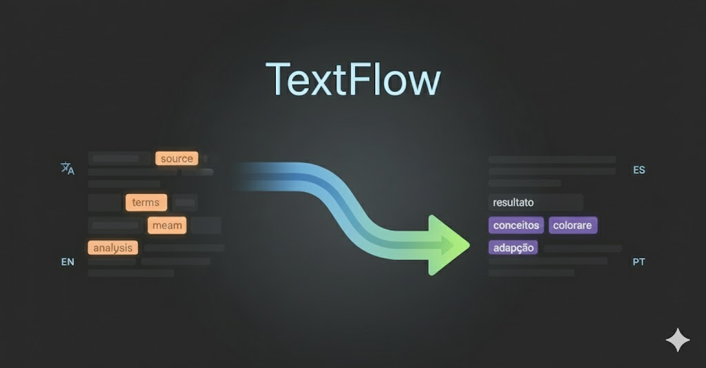

# 🔤 Humanize Text



<p align="center">
  
  
  
  
</p>

<p align="center">
  <strong>Transform formal, robotic text into natural, human-friendly language</strong>
</p>

A free, open-source tool to help content creators humanize their text across multiple languages. Convert formal phrases like "in order to" → "to" or "utilize" → "use" automatically in Google Docs, powered by a community-driven dictionary.

---

## ✨ Features

- 🌍 **Multi-language Support**: English, Persian, Spanish, Portuguese
- 🔄 **Real-time Replacement**: Safe text replacement preserving formatting and styles
- 📝 **Google Docs Integration**: Works directly in your documents via Apps Script
- 🎯 **Word Boundary Detection**: Smart matching prevents incorrect replacements
- 🆓 **100% Free**: No subscriptions, no limits
- 🤝 **Community-Driven**: Dictionary updated by users worldwide
- 🔌 **RESTful API**: Easy integration with automation tools
- ⚡ **Ready to Use**: No configuration needed - just copy and paste

---

## 🚀 Quick Start

Choose the version that fits your needs. Both are **ready to use** - no additional setup required!

### 🌐 API Method (Recommended)

Use our community-updated dictionary. Default language: **English** 🇺🇸

**API Server**: `https://humanize.serpify.dev`

**⚡ Zero Configuration - Just Copy & Paste!**

1. Open your Google Doc
2. Go to **Extensions → Apps Script**
3. Copy the entire content from **[`add-on/api-method.js`](add-on/api-method.js)**
4. Paste into the editor and save
5. Reload your Google Doc
6. Open the **🔤 Humanize Text** menu - it's ready to use!

**✨ What's Included:**
- ✅ Pre-configured API connection
- ✅ English as default language
- ✅ All 4 languages supported (English, Persian, Spanish, Portuguese)
- ✅ No editing required - works out of the box!

**To switch languages:**
- Menu: **🔤 Humanize Text → 🌍 Language → Select your language**

---

### 💻 Local Method

For complete privacy and custom dictionaries.

**⚡ Ready to Use - No Configuration Needed!**

**Step 1: Prepare Your Google Sheet**

Create a Google Sheet with this exact structure:

| no | robotic_phrasing | natural_tone | tag | patterns |
|----|------------------|--------------|-----|----------|
| 1 | utilize | use | Action | phrase_bot_common |
| 2 | in order to | to | Objective | phrase_bot_common |
| 3 | at this point in time | now / currently | Time | phrase_bot_common |
| 4 | due to the fact that | because / since | Reason | phrase_bot_common |

**Column Details:**
- **Column B** (`robotic_phrasing`): Formal phrase to replace
- **Column C** (`natural_tone`): Natural alternative(s) - use `/` to separate multiple options
- Other columns (A, D, E): Optional metadata

**📋 Example Sheet Template:** [View Sample](https://docs.google.com/spreadsheets/d/1tYYH6jheUyyGtbPewPpGlptTZR-zW0zU-R9Opak5qHI/edit)

**Step 2: Add Script to Google Docs**

1. Open your Google Doc
2. Go to **Extensions → Apps Script**
3. Copy the entire content from **[`add-on/local-setup.js`](add-on/local-setup.js)**
4. Paste and save
5. ⚠️ **ONLY change this line (line 2):** Replace with your Google Sheet ID:
   ```javascript
   const SHEET_ID = 'YOUR_SHEET_ID_HERE';
   ```
6. Reload your document
7. Use the **🔤 Humanize Text** menu

**That's it!** No other changes needed - the script works for any language automatically.

**Use Cases:**
- 🔒 Private/confidential dictionaries
- 🏢 Company-specific terminology
- 📚 Custom phrase collections
- 🌐 Offline usage
- 🎓 Educational/research purposes

---

## 📡 API Documentation

Base URL: `https://humanize.serpify.dev`

### Get Supported Languages

```http
GET /api/languages
```

**Response:**
```json
{
  "supported": ["fa", "en", "es", "pt"],
  "default": "en",
  "languages": {
    "en": "English",
    "fa": "Persian",
    "es": "Spanish",
    "pt": "Portuguese"
  }
}
```

### Get Dictionary (All Phrases)

```http
GET /api/dictionary?lang=en
```

**Query Parameters:**
- `lang` (optional): Language code (`en`, `fa`, `es`, `pt`). Default: `en`

**Response:**
```json
[
  {
    "from": "utilize",
    "to": "use"
  },
  {
    "from": "in order to",
    "to": "to"
  }
]
```

### Add New Phrase

```http
POST /api/dictionary
Content-Type: application/json

{
  "from": "at this point in time",
  "to": "now / currently",
  "lang": "en"
}
```

**Response:**
```json
{
  "success": true,
  "message": "Word added successfully",
  "data": {
    "from": "at this point in time",
    "to": "now / currently",
    "lang": "en"
  }
}
```

### Update Phrase

```http
PUT /api/dictionary/:from?lang=en
Content-Type: application/json

{
  "from": "utilize",
  "to": "use / employ"
}
```

### Delete Phrase

```http
DELETE /api/dictionary/:from?lang=en
```

### Search Phrases

```http
GET /api/dictionary/search/:query?lang=en
```

---

## 🤝 Contributing

**We'd love your help!** This is a community-driven project that gets better with every contribution.

### 🌟 Ways to Contribute

#### 1. **Add New Phrases**
Use the "Add New Word" feature in the Google Docs menu to submit phrases directly to our API dictionary.

#### 2. **Report Issues**
Found a bug or error in translations?
- [Open an Issue](https://github.com/xoxxel/Humanize-Text/issues) on GitHub
- Describe the problem clearly
- Include language code and phrase examples

#### 3. **Add New Languages**
Want to add support for a new language?

**Steps:**
1. Fork the repository
2. Create a new dictionary file: `dictionary/{lang-code}.json`
   ```json
   [
     {
       "from": "formal phrase",
       "to": "casual alternative / another option"
     }
   ]
   ```
3. Update `SUPPORTED_LANGS` in `server.js`
4. Add language to menu in `add-on/api-method.js`
5. Submit a Pull Request

**Languages we'd love to see:** Arabic, French, German, Italian, Chinese, Japanese, and more!

#### 4. **Improve Existing Dictionaries**
- Found better alternatives for phrases?
- Spotted incorrect translations?
- Have regional variations to add?

Submit a PR with updates to the relevant `dictionary/{lang}.json` file.

#### 5. **Enhance Code Quality**
- Code improvements
- Bug fixes
- Performance optimizations
- Documentation updates

All contributions are welcome!

---

### 📋 Contribution Guidelines

**Quality Standards:**
- ✅ Submit phrases you'd actually use in real writing
- ✅ Provide natural, conversational alternatives
- ✅ Use `/` to separate multiple options (e.g., "to / so that")
- ✅ Consider context - formal writing varies by language and culture
- ✅ Test your phrases before submitting

**Submission Process:**
1. **For Phrases**: Use the in-app "Add New Word" feature OR submit via API
2. **For Code/Languages**: Fork → Branch → Commit → Pull Request
3. **For Bugs**: Open a detailed issue with reproduction steps

**Review Process:**
- Pull requests are reviewed within 48-72 hours
- Community feedback is encouraged
- Maintainers may request changes for quality assurance

---

### 🐛 Report Bugs & Language Issues

Help us improve! If you encounter:
- ❌ Incorrect translations
- ❌ Phrases that don't make sense
- ❌ Cultural/regional inconsistencies  
- ❌ Technical bugs or errors

**Please report by:**
1. [Opening a GitHub Issue](https://github.com/xoxxel/Humanize-Text/issues/new)
2. Include:
   - Language code (e.g., `en`, `fa`, `es`)
   - The problematic phrase
   - Expected vs actual behavior
   - Screenshots if applicable

Your feedback makes this tool better for everyone! 🙏

---

## 🛠️ Local Development

Want to run your own API server?

### Prerequisites

- Node.js 18+
- npm or yarn

### Installation

```bash
# Clone the repository
git clone https://github.com/xoxxel/Humanize-Text.git
cd Humanize-Text

# Install dependencies
npm install

# Start the server
npm start
```

Server runs on `http://localhost:3000`

### Development Mode

```bash
npm run dev
```

Uses `nodemon` for auto-restart on file changes.

---

## 🔮 Future Roadmap

We're actively working on exciting new features:

- 🔧 **Automation Integration**: n8n, Zapier, and Make.com connectors
- 🧹 **Text Normalization**: Automatic removal of irregular characters
- 📏 **Space Correction**: Fix half-spaces and spacing issues
- 🎨 **Browser Extension**: One-click humanization in any web text field
- 📊 **Analytics Dashboard**: Track most-used phrases and community contributions
- 🌐 **More Languages**: Arabic, French, German, and beyond
- 🤖 **AI Suggestions**: Smart phrase recommendations based on context

---

## 📄 License

This project is licensed under the **MIT License** - free to use, modify, and distribute.

---

## 👨‍💻 Author

**xoxxel**  
🌐 [serpify.dev](https://serpify.dev)

---

## 💝 Support This Project

If Humanize Text helps your workflow:

- ⭐ **Star this repository**
- 🐛 **Report bugs** to help us improve
- 📝 **Add phrases** to grow the community dictionary
- 🔗 **Share** with fellow content creators

---

<p align="center">
  <strong>Made with ❤️ for the content creator community</strong>
</p>

<p align="center">
  <em>Helping writers create more natural, engaging content</em>
</p>
